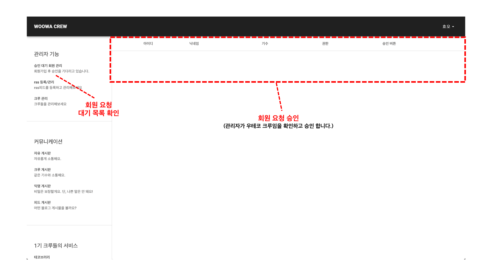
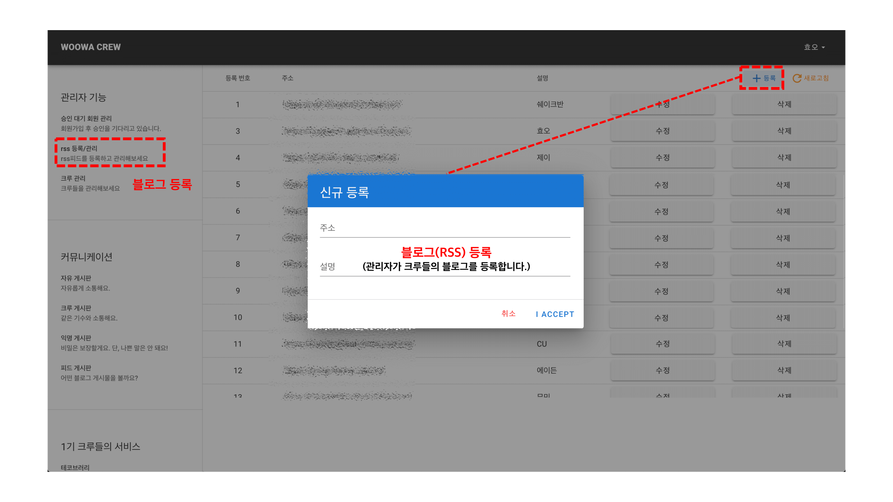
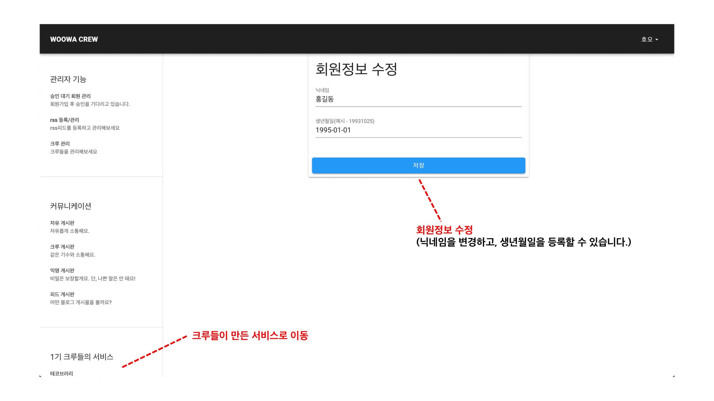
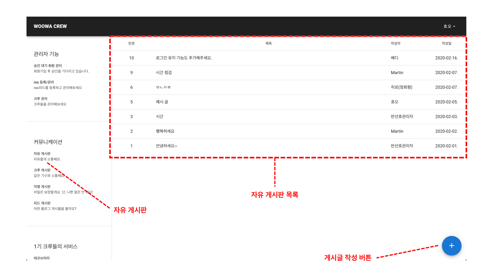
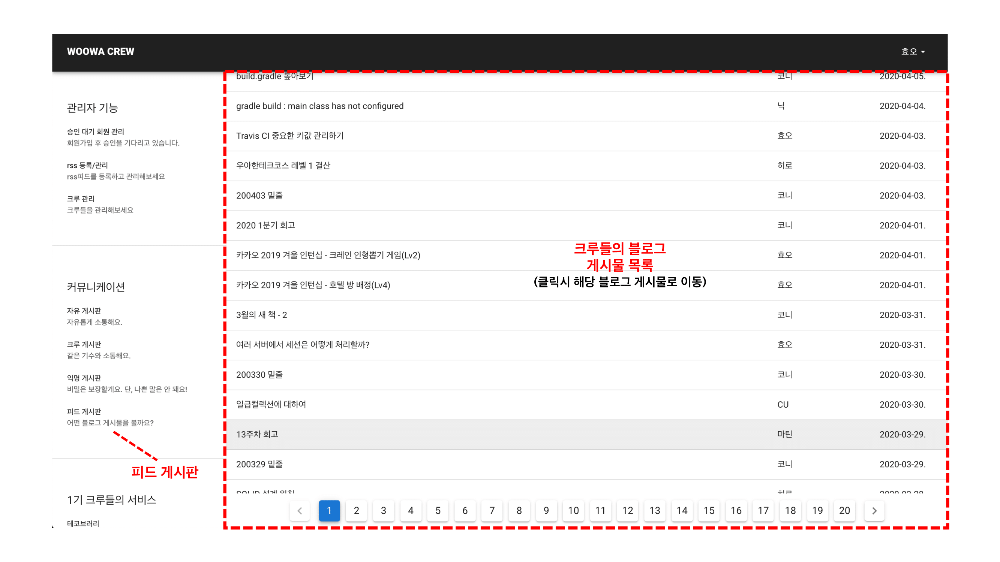
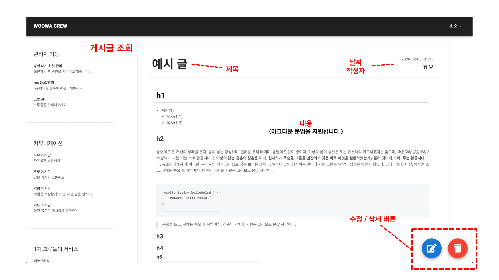
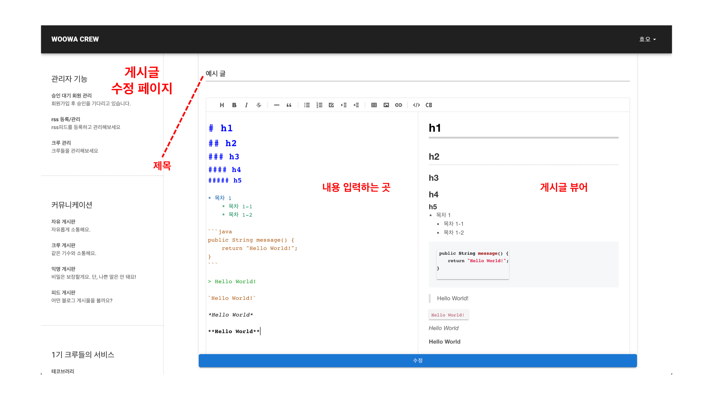
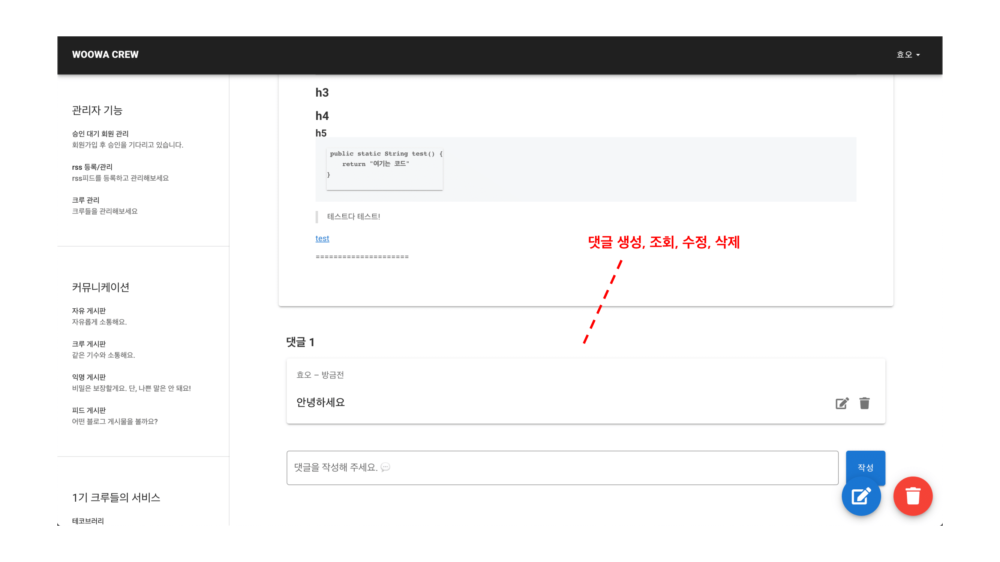
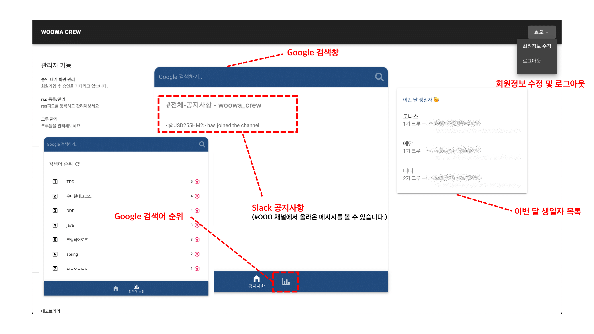
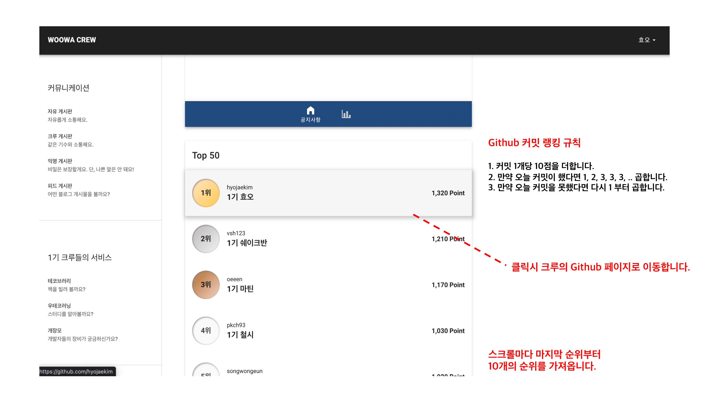

# 🙋🏻‍♂️ 팀원 소개

| 이름 | 닉네임 | Github |
|:---:|:---:|:---:|
| 김효재 | 효오 | [hyojaekim](https://github.com/hyojaekim) |
| 반선호 | 쉐이크반 | [vsh123](https://github.com/vsh123) |
| 정현수 | 지노 | [hyunssooo](https://github.com/hyunssooo) |
| 박경철 | 철시 | [pkch93](https://github.com/pkch93) |
| 송원근 | 히브리 | [yk1028](https://github.com/yk1028) |
| 전성모 | 마틴 | [oeeen](https://github.com/oeeen) |

# 🖥 기능 소개

| 번호 | 기능 | 설명 |
|:---:|---|---|
| 1 | 로그인 | SpringSecurity를 활용한 Github OAuth 적용 |
| 2 | 관리자 페이지 | RSS 관리, 회원 승인, 크루들의 권한 및 기수를 설정 할 수 있습니다. |
| 3 | 자유 게시판 및 댓글 | 누구나 자유롭게 소통할 수 있는 공간 입니다. |
| 4 | 크루 게시판 및 댓글 | 같은 기수의 크루들끼리 소통할 수 있는 공간 입니다. |
| 5 | 익명 게시판 및 댓글 | 익명으로 소통할 수 있는 공간 입니다. |
| 6 | 피드 게시판 및 RSS 관리 | 크루들의 블로그 게시글을 볼 수 있습니다. |
| 7 | 우테코 관련 서비스 이동 | 크루들이 만든 서비스로 이동할 수 있습니다. |
| 8 | 구글 검색 및 검색어 순위 | 검색창을 통해 구글 검색이 가능하며, 검색어 순위를 조회할 수 있습니다. |
| 9 | 이번 달 생일자 목록 | 이번 달에 생일을 맞이하는 사람들을 조회할 수 있습니다. |
| 10 | Github 커밋 랭킹 | Github 커밋 내역에 따라 랭킹을 보여줍니다. |
| 11| 슬랙 채널 메시지 조회 | 슬랙봇이 존재하는 채널의 메시지를 조회할 수 있습니다. |

# 🛠 기술 스택

**Backend `Java` `SpringBoot` `SpringDataJPA` `SpringSecurity` `SpringRestDocs` `Gradle`**

**Frontend `Javascript` `Vue.js` `Vuetify`**

**Database `MySQL` `H2`**

**Infra `AWS EC2` `Jenkins` `Docker`**

**Version Control `Git`**

**Issue Tracker `Github Issues`**

# 🔗 링크

- [이슈 관리](https://github.com/WoowaCrew/WoowaCrew/projects/2)
- [PR](https://github.com/WoowaCrew/WoowaCrew/pulls?q=is%3Apr+is%3Aclosed)
- [Wiki](https://github.com/WoowaCrew/WoowaCrew/wiki)
    - [팀 규칙](https://github.com/WoowaCrew/WoowaCrew/wiki/%5BWoowaCrew%5D-%EC%9A%B0%EB%A6%AC%ED%8C%80-%EA%B7%9C%EC%B9%99)
    - [Code Convention](https://github.com/WoowaCrew/WoowaCrew/wiki/%5BWoowaCrew%5D-%EC%BD%94%EB%93%9C-%EC%BB%A8%EB%B2%A4%EC%85%98)
    - [Spring Security In WoowaCrew](https://github.com/WoowaCrew/WoowaCrew/wiki/Spring-Security-In-WoowaCrew)
    - [WoowaCrew CI/CD 적용기](https://github.com/WoowaCrew/WoowaCrew/wiki/WoowaCrew-CI---CD-%EC%A7%84%ED%96%89%EA%B8%B0)
    - [WoowaCrew CI/CD 프로세스](https://github.com/WoowaCrew/WoowaCrew/wiki/WoowaCrew-CI-CD-%ED%94%84%EB%A1%9C%EC%84%B8%EC%8A%A4)
    - [Docker 사용 정리](https://github.com/WoowaCrew/WoowaCrew/wiki/WoowaCrew%EB%A5%BC-%EC%9C%84%ED%95%9C-Docker-%EC%82%AC%EC%9A%A9-%EC%A0%95%EB%A6%AC)
    - [Gradle 테스트 폴더 분리](https://github.com/WoowaCrew/WoowaCrew/wiki/gradle-%ED%85%8C%EC%8A%A4%ED%8A%B8-%ED%8F%B4%EB%8D%94-%EB%B6%84%EB%A6%AC)
    - [Spring Rest Docs 적용](https://github.com/WoowaCrew/WoowaCrew/wiki/Spring-rest-docs)
    - [검색 기능 추가하기](https://github.com/WoowaCrew/WoowaCrew/wiki/%5B%EA%B8%B0%ED%83%80%5D-%EA%B2%80%EC%83%89-%EC%A0%81%EC%9A%A9%ED%95%98%EB%8A%94-%EB%B0%A9%EB%B2%95)